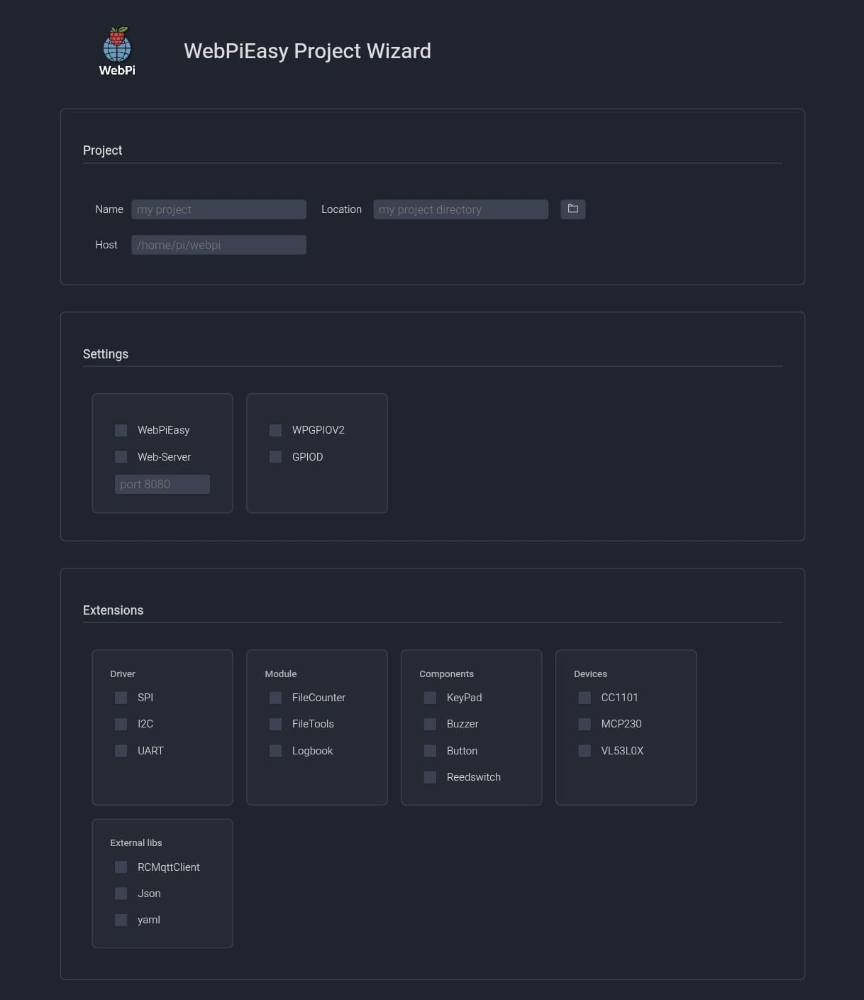
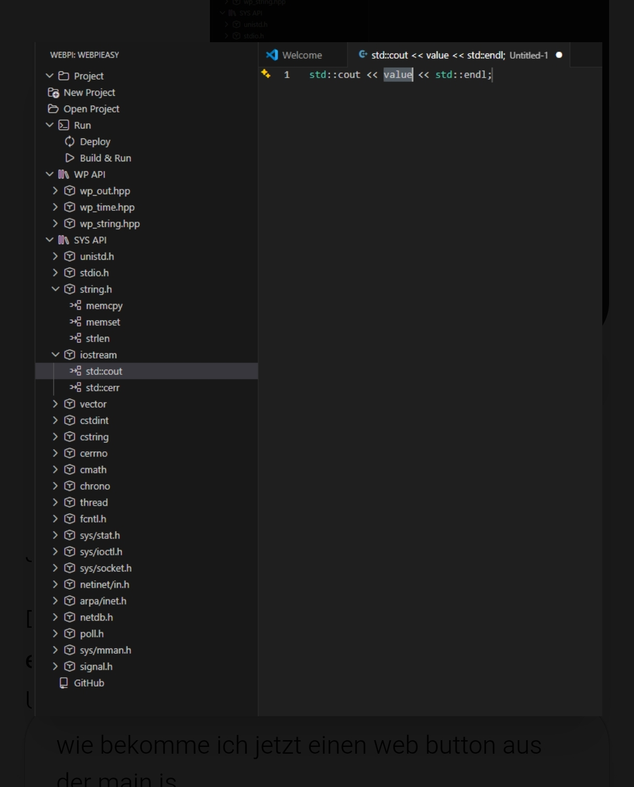

  

   
<!--<h2 align="center">The Hardware and Software Logic Framework</h2>
 

<h6><a href="README_DE.md">German version</a> | <a href="STORY.md">Story of WebPi</a></h6>
-->

## 📰 Latest News & Dev-Logs

**Update 01.04.2026: WebPiCode Extension Preview!**
  
Es wird mit Hochdruck an **WebPiCode** gearbeitet, der offiziellen VS Code Extension. 
  

#### 🆕 Der neue Project Wizard
Erstellt dein Projekt modular per Mausklick:
  - WebPiEasy: C++ Wrapper im Arduino-Style für schnellen Erfolg.
  - Driver:    Voller Support für Raspberry SPI, I2C und UART.
  - Modules:   Logbook, FileTools, FileCounter und mehr.
  - Devices:   Direkte Integration von CC1101, MCP230 (08/17), VL53L0X etc.
  - GPIO:      Wahlweise **WPGPIOV2** oder der **WPGPIOD-Standard**.
  - SYS:       Viele gängige System-Header Funktionen stehen bereit.
  

#### 🖥️ Intelligente Sidebar & API-Anbindung
Die Sidebar erkennt automatisch die **WebPiEasy-API** (out, time, string...) sowie die **System-API** (unistd, stdio, iostream...).
 
Für die IntelliSense und Tree Handhabung, wurde ein Header-Parser erstellt. Dieser sammelt und formatiert die benötigten Json und Stub Dateien. Zur Umsetzung dienen die Kommentarblöcke der Header nun auch als Datenquelle. So entwickelst du am PC mit der intelligenten Unterstützung des Editors.
  

#### ❔ Was dich erwartet
Das Ziel ist ein nahtloser Workflow mit WebPi.
Das Repo auf den Raspberry klonen, Extension in VS Code installieren und sofort loslegen.
Alles bleibt optional, es kann auch das native CMake-System genutzt werden.
Für den perfekten Einstieg wird **WebPiStart** empfohlen.
  

#### 🔜 Roadmap bis zum Release
   - Drag & Drop:  Funktionen einfach aus der Sidebar an die gewünschte Stelle im Editor ziehen.
   - Auto-Header:  Automatische Auflösung und Inkludierung benötigter Header-Abhängigkeiten.
   - Remote-Sync:  Automatischer Upload der Sourcen via SSH auf den Raspberry Pi.
   - One-Click  :  Kompilieren und Ausführen der Binaries direkt aus VS Code heraus.
   - Templates  :  HTML, JS und CSS Templates, um sofort moderne Web-Interfaces für deine Hardware zu bauen.
   - Examples & Apps: Integration im VS Code Tree. Kompilieren, Ausführen und ausprobieren.
  

#### 🖼️ Ersten Einblicke in die Entwicklung
Der Project Wizard

  
Die neue Sidebar mit voller API-Einsicht.

  

#### 🏀 Bleib am Ball
WebPi wird dich bei deinen Projekten auf dem Raspberry Pi vereinfacht und schnell erfolgreich unterstützen!
