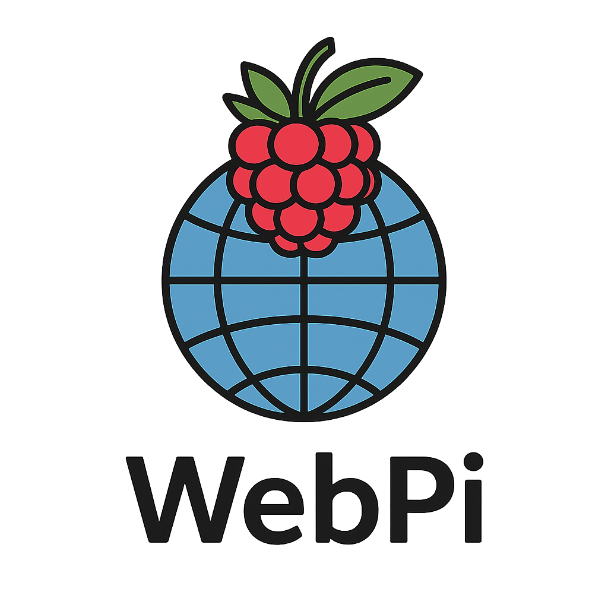
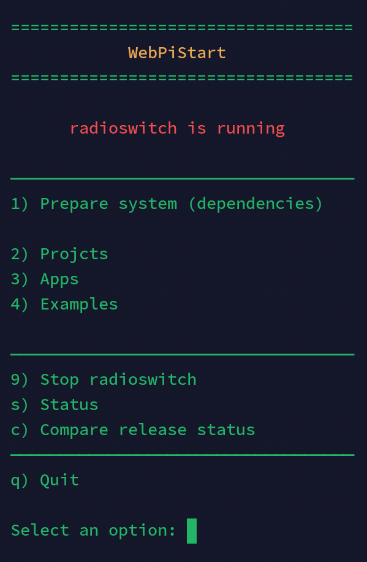
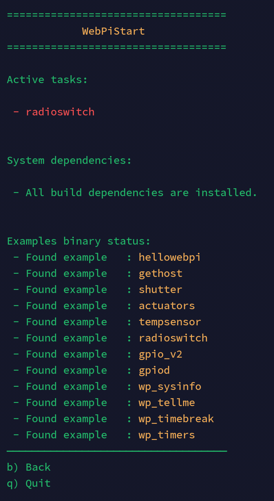
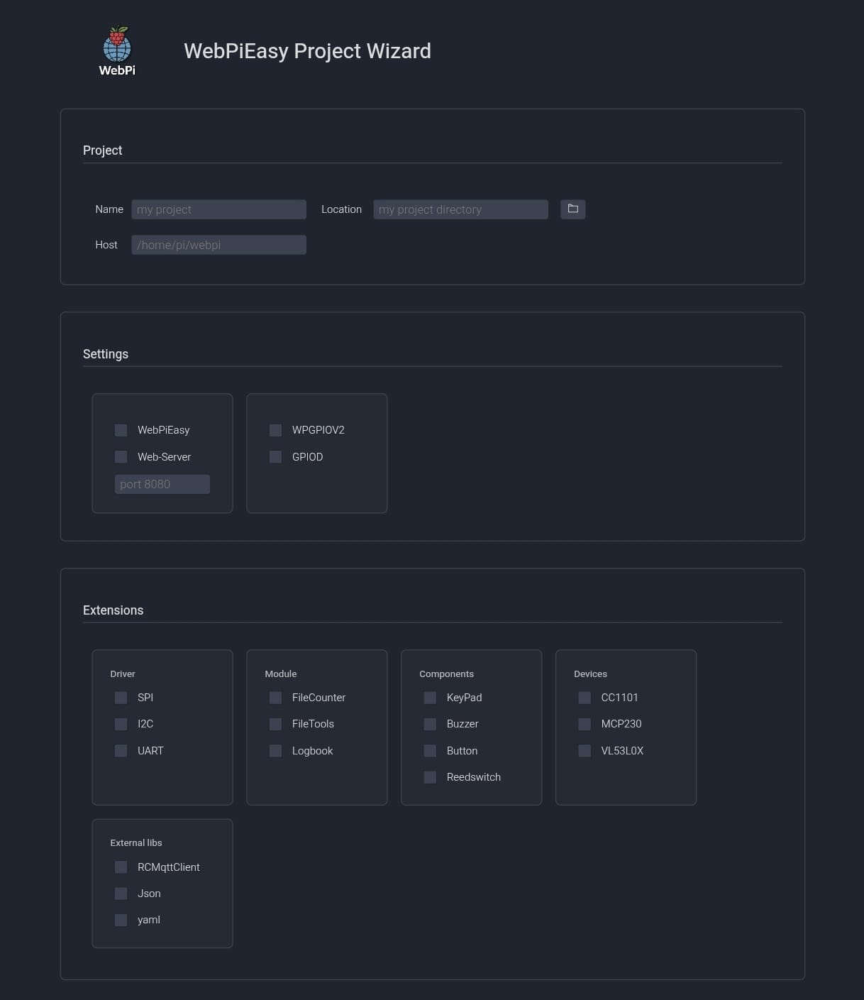
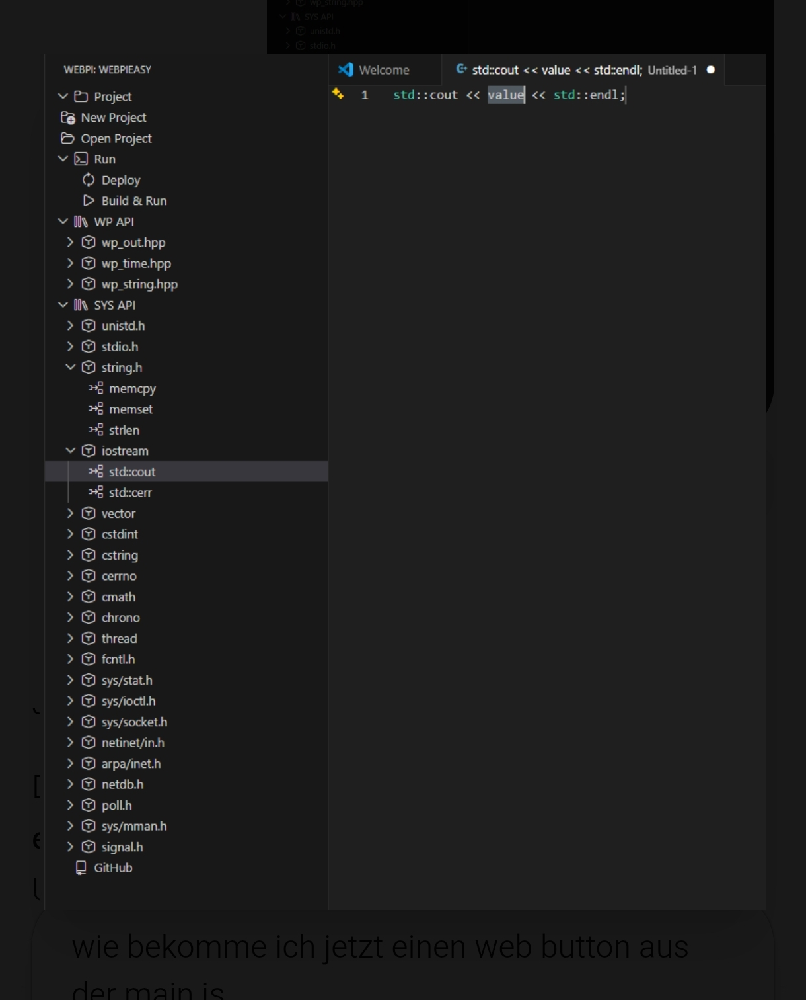

   

 
<!--<h2 align="center">The Hardware and Software Logic Framework</h2>
 

<h6><a href="README_DE.md">German version</a> |  <a href="STORY.md">Story of WebPi</a></h6>
-->

 ## 📰 Latest News & Dev Logs
 
**Update July 24st, 2026: Dev Update: Refocusing for an Earlier Release!**
  
### 📢 Full concentration on the release
 
We’ve made a strategic decision to aim for an earlier official release by narrowing
our focus onto the **WebPiCore** and its essential surrounding ecosystem.

To keep our momentum high, **WebPiCode** is being temporarily put on hold.
Don't worry — it’s definitely coming, just a bit further down the roadmap
once the core foundation is rock solid!

### 🛠️ What we’re currently working on:

  🔥 **WebPiCore**
      Bug fixes, performance tuning, and stability improvements.

  ⌛ **WebPiStart** (CLI Tool)
      Main Menu Restructuring:
         - Apps: Dedicated app management.
         - Projects: Streamlined creation wizard, project listing, building,
                     start/stop management, and background daemon execution (keep-running mode).
         

Main-Menu. 

Binary status. 

Project-Menu. 

Create new Project 

  🤖 **Libs & Extensions**
      - Devices: Refactoring and updating drivers for MCP23017/08, VL53L0X, and CC1101.
      - Drivers: New wp_udp_client driver implementation.
      - Components: Comprehensive review and cleanup across all components.

  🎯 **Examples**
      - Buzzer sound integration.
      - High-speed GPIO Benchmark.
      - Radio Switch (a first sneak peek into the upcoming RadioPi app!).

  📖 **Documentation**
      - Updated main README.md including branching model explanations.
      - Adding detailed sub-module README files for better developer onboarding.

  🔮 **Visions for the Future**
      - WebPiCode & WebPi IDE: Seamless, integrated C++ development environments.
      - WebPi App Hub: A central platform to discover, install, and share custom WebPi apps with the community.
      
### ℹ️
   We attach great importance to delivering WebPi in a polished, reliable state.
   There is still plenty of work ahead, but we are pushing hard toward our first release.
   
   Stay tuned! 🚀
     
 **Update April 1st, 2026: WebPiCode Extension Preview!**
   
 We are working hard on **WebPiCode**, the official VS Code Extension. 
   

#### 🆕 The new Project Wizard
Create your project modularly with a single click:
- WebPiEasy: Arduino-style C++ wrapper for quick success.
- Drivers: Full support for Raspberry Pi SPI, I2C, and UART.
- Modules: Logbook, FileTools, FileCounter, and more.
- Devices: Direct integration of CC1101, MCP230 (08/17), VL53L0X, etc.
- GPIO: Choose between **WPGPIOV2** or the **WPGPIOD standard**.
- SYS: Many common system header functions are available.
  

#### 🖥️ Intelligent Sidebar & API Integration
The sidebar automatically detects the **WebPiEasy API** (out, time, string, etc.) as well as the **System API** (unistd, stdio, iostream, etc.).
  
For IntelliSense and Tree handling, a header parser has been created. This collects and formats the necessary Json and Stub files. The header comment blocks now also serve as a data source. This allows you to develop on your PC with the editor's intelligent support.
  

#### ❔ What to expect
The goal is a seamless workflow with WebPi.
Clone the repository to your Raspberry Pi, install the extension in VS Code, and get started right away.
Everything remains optional; you can also use the native CMake system.
For the perfect start, **WebPiStart** is recommended.
  

#### 🔜 Roadmap to release
- Drag & Drop: Simply drag functions from the sidebar to the desired location in the editor.
- Auto-Header: Automatic resolution and inclusion of required header dependencies.
- Remote Sync: Automatically upload source code to your Raspberry Pi via SSH.
- One-Click: Compile and run binaries directly from within VS Code.
- Templates: HTML, JS, and CSS templates to instantly build modern web interfaces for your hardware.
- Examples & Apps: Integration within the VS Code tree. Compile, run, and try it out.
  

#### 🖼️ First glimpses into development

The Project Wizard 

  

The new sidebar with full API access. 

  
#### 🏀 Stay tuned!
WebPi will simplify and quickly help you succeed with your Raspberry Pi projects!
