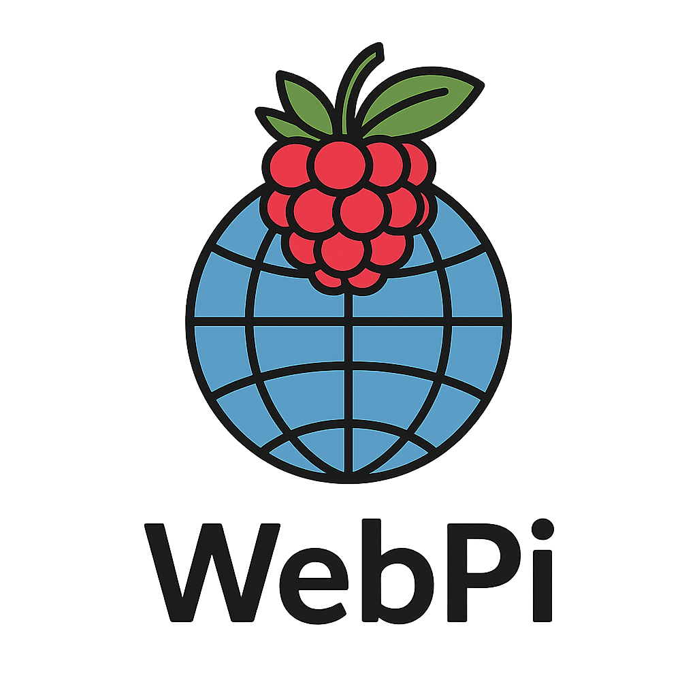
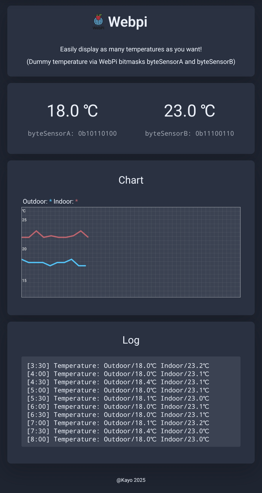

<p align="center"></p>

<h3 align="center">The Hardware and Software</h3>
<h3 align="center">Logic Framework</h3>


---

**[Auf Deutsch lesen 🇩🇪](README_DE.md)**

**The bridge between modern Linux and your hardware projects.**

WebPi is a lightweight C++ web interface framework for the Raspberry Pi. It was designed to make sensors, actuators, and device states controllable via a simple HTTP API and a clean, modern web UI—without the overhead of heavy external frameworks.

**"Open, honest, and transparent."**

WebPi is not just a tool; it is an invitation to discover the world of C++ and hardware-oriented programming.

---

## ⚛️ The Philosophy
WebPi was born from the experience that developing on the Raspberry Pi is becoming increasingly complex and difficult. Between kernel updates (Debian 13 Trixie) and hardware changes (Pi 5), the simple "GPIO feeling" is often lost.

WebPi brings that feeling back. It wraps complex mechanisms into clear, readable interfaces. It doesn't hide how things work—it explains them and makes C++ accessible to everyone.

---

## ✨ Highlights

* **🌐 Self-Contained Ecosystem:** Integrated HTTP server and modular core system. No external web server like Apache or Nginx required.
* **🔢 Bitmask Logic:** Efficient, predictable, and easy to visualize. Handling of 8-bit or 16-bit states remains consistent throughout the system.
* **🛠 Modular Power:** Use only what you need. The user-friendly **WebPiEasy** offers many simplified wrapper functions. From hardware modules (expanders, radio modules, distance sensors) to easy-to-understand board drivers like SPI, I2C, and UART.
* **🔌 GPIO Control:** WebPi comes with its own simplified GPIO library. Configure Output/Input, Read/Write (setPin/getPin), and even a small interrupt function is included.
* **📖 Your Progress:** Many WebPi functions serve you with default parameters but can be customized with your own values.
* **🛟 WebPi-Start:** A bash-based control center that manages dependencies and builds at the touch of a button. For an easy start, it builds the control and learning platform **WebPiUI**, allowing you to dive right in. Build examples and compare the code with the visual web interface—understand what works, how, and why.
* **⚠️ WebPi-Apps:** Ready-to-use applications from system and custom libraries. Adapt the applications to your needs and make them your own project.

---

## 🧱 Architecture Overview
WebPi is modular and clearly structured. The extensions are not linked to each other and can therefore also be used for your own purposes.

```text
WebPi/
├─ core/            # The heart (API, bitmasks, server)
├─ apps/            # Central directory for WebPi applications to use, extend, and adapt.
├─ docs/            # First steps with WebPi, extended function descriptions, and project info.
├─ extensions/      # Extensions to make your start and "life" easier.
│  ├─ webpidevices/    # Support for common and popular hardware modules (constantly expanding).
│  ├─ webpimodules/    # Built-in tools with simple and understandable interfaces.
|  ├─ webpidrivers/    # Basic drivers for GPIO controllers and pin control.
│  └─ webpieasy/       # A collection of wrappers to facilitate your entry. Simple functions, short names, without hiding the internal C++ core.
├─ examples/        # From "Hello WebPi" (the skeleton) to SVG temperature graphs and hands-on bitmask handling.
└─ webpiStart       # The "Swiss Army Knife" for your first steps with WebPi.
```
---

🔢 Hands-on Bitmask Concept
WebPi makes binary logic visible. The actuators example shows directly how the internal 8-bit mask corresponds with the web interface.


*Clarity through visualization: Bitmask states in real-time.*


---

📈 Ready for Real Data
Whether it's temperature trends or system logs – WebPi already provides the tools in its core to not only process data but also present it attractively.



*Example of a sensor integration with SVG charts and logbook function.*


---

🛠️ WebPi Status
WebPi is in an advanced stage shortly before its official release.
You can follow the development via the source list.

Stay tuned!
