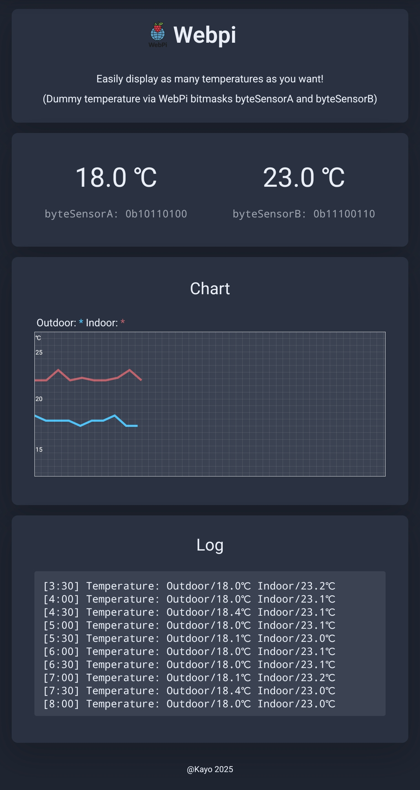

<div align="center">
  
</div>
<h3 align="center">WebPi – The Hardware and Software Logic Framework</h3>
<br>
<div><h6><a href="README_DE.md">German version</a> | <a href="STORY.md">Story of WebPi</a></h6></div>

---

**🚀 WebPi: The bridge between modern Linux and your hardware projects.**

WebPi is a lightweight C++ web interface framework for the Raspberry Pi. It was designed to make sensors, actuators, and device states controllable via a simple HTTP API and your own web interface without the overhead of heavy external frameworks.

**"Open, honest, and transparent."**

WebPi aims to bring the world of C++ and hardware level programming closer to everyone while making the entry point as easy as possible.


---

## ⚛️ The Philosophy
WebPi was born from the experience that developing on the Raspberry Pi is becoming increasingly complex. That classic "GPIO feeling" just quickly making an LED blink has somewhat been lost.

WebPi brings that feeling back. It wraps complex mechanisms into clear, readable, and memorable functions, making C++ accessible to everyone.


---

## ✨ Highlights

* **🌐 Self-contained Ecosystem:**
     - Integrated HTTP server and modular core system. No external web server like Apache or Nginx required.

* **💽 WebPi RAM:**
     - Real RAM? No, but a perfect mirror image. A memory module for every purpose, combined with efficient functions in a lightweight design. With WebPiEasy, hardware control becomes pure high-level programming.
     - Integrated bitmasks for getting started right away.
     - Bit manipulation made easy. Switch bits or store entire sensor values ​​for 8-bit, 16-bit, or even 32-bit states.

* **🛠 Modular Design:**
     - Use only what you need. Header-only classes ready for any use case, whether within WebPi or for standalone projects modular and customizable.
     - The user friendly **WebPiEasy** featuring many simplified wrapper functions similar to an Arduino sketch.
     - From hardware modules (expanders, radio modules, rangefinders) to easy to understand board drivers like SPI, I2C, and UART.

* **🔌 GPIO Control:**
     - Use WebPiGPIO V2, the libgpiod + wrapper, or other GPIO libs you decide what fits your needs.
     - Configure via `configPin()`, read/write via `setPin()` / `getPin()`. Control GPIOs with short and concise syntax.

* **📖 Your Progress:**
     - Many WebPi functions serve you with default parameters but can be fully customized with your own values.

* **🛟 WebPi-Start:**
     - A Bash based, menu driven startup tool that manages dependencies and builds at the touch of a button.
     - For an easy start it builds the **WebPiUI** control and learning platform allowing you to dive right in.
     - Build examples and compare code with the visual web interface see what works, how, and why.

* **⚠️ WebPi-Apps:**
     - Ready to use apps. Adapt the applications to your needs and turn them into your own project.
     - Everything C++, system headers and WebPi have to offer finds its place here for immediate use or as inspiration for your visions.


---

## 🧱 Architecture Overview
WebPi is modular and clearly structured. The extensions are not hardlinked, meaning they can also be used for your own independent purposes.

```

WebPi/
├─ core/          # Basic syntax structure in microcontroller style (Arduino/Pico), user API, internal bitmasks, web server
├─ apps/          # Central directory for using, extending, and customizing WebPi applications. Everything WebPi offers is bundled here.
├─ docs/          # First steps in using WebPi, extended function descriptions, and information about this project.
├─ extensions/        # Extensions that make getting started and using WebPi easier.
│ ├─ devices/        # Common and popular hardware modules are supported and will be expanded over time.
│ ├─ modules/        # Onboard tools with simple and understandable interfaces.
│ ├─ drivers/        # Basic drivers for the GPIO controllers and pin control.
│ ├─ components/  # Input and output components such as keypads, buzzers, buttons, and much more.
│ ├─ integration/ # Easily integrate logging, file counters, and MQTT into your project, or organize project files.
│ └─ easy/        # WebPiEasy is a wrapper package designed to make getting started easier. It features simple functions, short, memorable names, and the internal C++ core remains exposed.
├─ examples/       # From "Hello WebPi," the basic WebPi framework, to SVG temperature graphs and bitmask handling, this is all there for you. Experience the interplay of C++, HTML, JavaScript, and CSS for a perfect result.
└─ webpiStart      # For your first steps with WebPi. Optionally checks and resolves dependencies. Build and launch WebPiUI examples.

```

---

🔢 The Bitmask Concept
WebPi makes binary logic visible. Examples like `actuators` or `shutter` demonstrate directly how the internal 8-bit mask interacts with the webinterface.

<div align="center">


Clarity through visualization Bitmask states in real-time.
</div>


---

📈 Ready for Data
Whether it's temperature logs or system monitoring, WebPi helps you realize your ideas.
<div align="center">

  
Example of sensor integration with SVG charts and logging functionality.
</div>


---

🛠️ WebPi Status
WebPi is in an advanced stage, nearing release.
You can follow the development via the source list.
Stay tuned!
