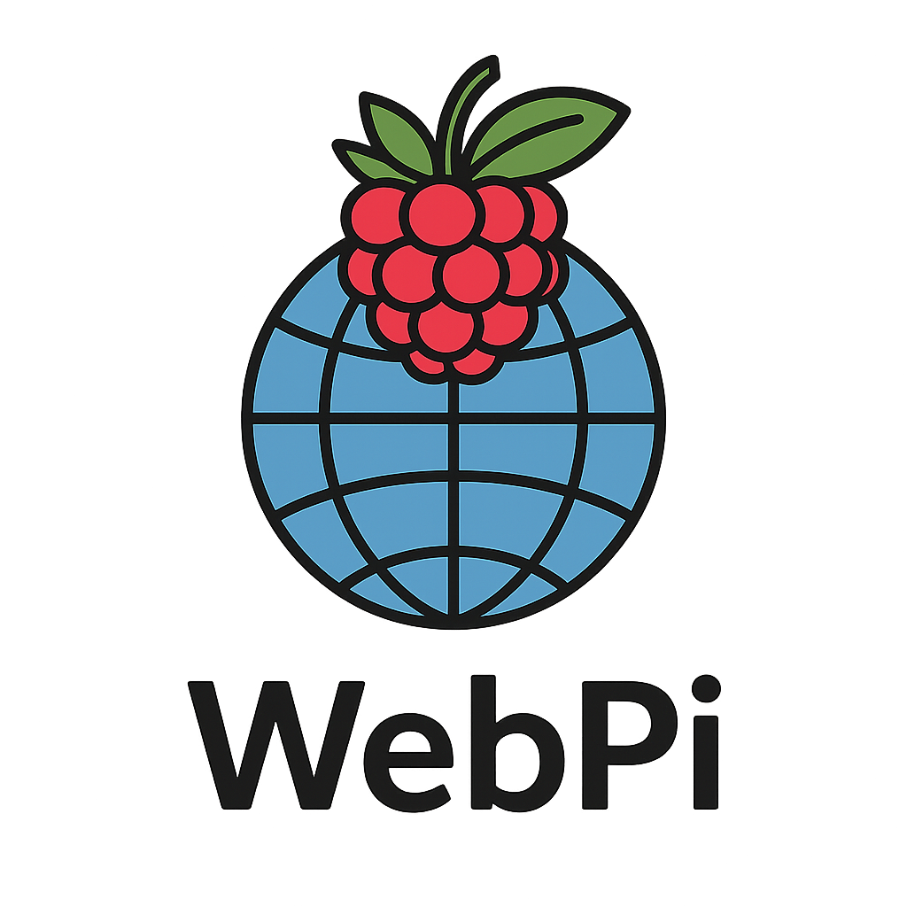
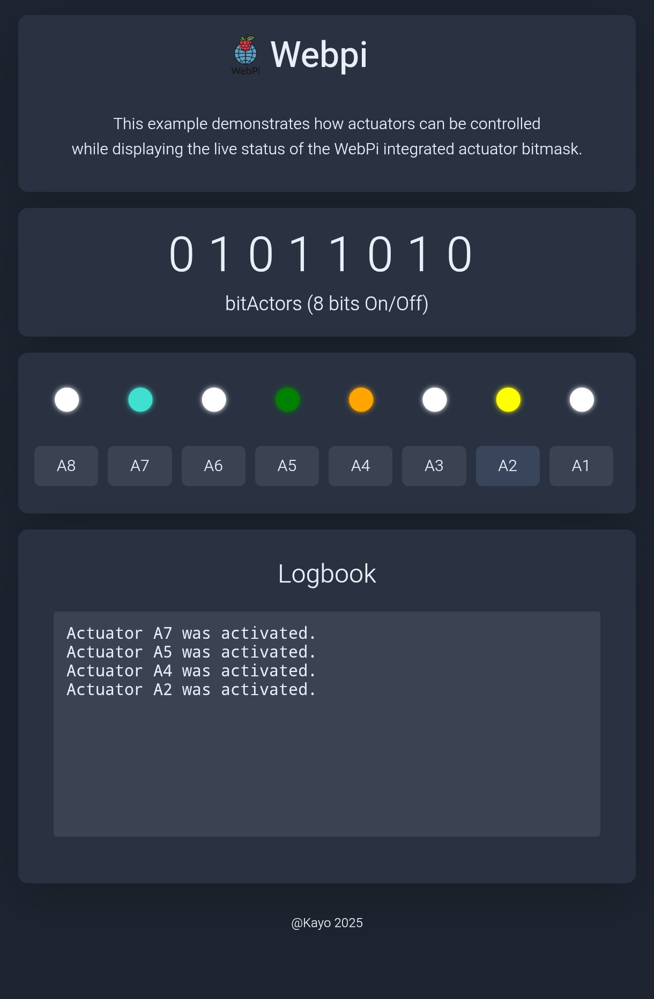

<div align="center">
  
</div>
<h3 align="center">Das Hardware und Software-Logik Framework</h3>
<br>
<br>
<div><h6><a href="NEWS.md">**NEWS**</a><h6><a href="README.md">English version</a> | <a href="STORY.md">Story of WebPi</a></h6></div>


---

**🚀 WebPi die Brücke zwischen modernem Linux und deinen Hardware-Projekten.**

WebPi ist ein leichtgewichtiges C++ Webinterface-Framework für den Raspberry Pi. Es wurde entwickelt, um Sensoren, Aktoren und Gerätezustände über eine einfache HTTP-API und deiner eigenen Weboberfläche steuerbar zu machen – ohne den Ballast schwerfälliger externer Frameworks.

**"Offen, ehrlich und transparent."**

WebPi soll die Welt von C++ und der hardwarenahen Programmierung näher bringen und den Einstieg erleichtern.

---

## ⚛️ Die Philosophie
WebPi entstand aus der Erfahrung, dass die Entwicklung auf dem Raspberry Pi immer komplexer und schwieriger wird. Das gute "GPIO-Gefühl" und mal schnell eine LED blinken lassen ist verloren gegangen.

WebPi bringt dieses Gefühl zurück. Es verpackt komplexe Mechanismen in klare, lesbare und merkbare Funktionen und macht C++ für jeden zugänglich.

---

## ✨ Highlights

* **🌐 Autarkes Ökosystem:**
     - Integrierter HTTP-Server und modulares Core-System. Kein externer Webserver wie Apache oder Nginx erforderlich.

* **💽 WebPi-RAM:**
     - Echter RAM? Nein, aber ein perfektes Spiegelbild. Ein Speicherriegel für jeden Zweck, kombiniert mit effizienten Funktionen in leichtgewichtiger Bauweise. Mit WebPiEasy wird Hardware-Steuerung zu purem High-Level-Programmieren.
     - Die integrierten Bitmasken zum sofort loslegen.
     - Bit Manipulation zum Verstehen. Bits schalten oder ganze Werte von Sensoren unterbringen für 8Bit, 16Bit oder sogar 32Bit Zustände.

* **🛠 Modularer Aufbau:**
     - Nutze nur, was du brauchst. Header-only Klassen für jeden Einsatz bereit, ob WebPi oder für eigenständige Projekte, modular und anpassbar.
     - Das Benutzerfreudliche WebPiEasy, mit vielen vereinfachten Wrapper Funktionen wie in einem Arduino Sketch.
     - Von Hardware-Modulen Expander, Funkmodulen und Entfernungsmesser bis zu einfach verständlichen Board-Treibern wie SPI, I2C und UART.

* **🔌 GPIO-Steuerung:**
     - Nutze WebPiGPIO V2, den libgpiod Wrapper oder andere gpio libs. du entscheidest was du brauchst.
     - Konfigurieren Output/Input configPin(), Schreiben/Lesen setPin() / getPin(). Steuere GPIOs mit kurzen und übersichtlichen Syntax.

* **📖 Dein Fortschritt**
     - Viele WebPi-Funktionen bedienen dich per Default-Parameter und können mit eigenen Werten angepasst werden.

* **🛟 WebPi-Start:**
     - Das Bash basierende Menü geführte Start-Tool, das Abhängigkeiten, Builds auf Knopfdruck verwaltet.
     - Für den einfachen Start baut es euch die Kontroll und Lernplattform WebPiUI mit der ihr dann voll einsteigen könnt.
     - Examples bauen und Code mit der visuellen Weboberfläche vergleichen, was funktioniert wie und warum.

* **⚠️ WebPi-Apps:**
     - Apps zum sofort loslegen. Passe dir die Applikationen an deine Bedürfnisse an und mache sie zu deinem Projekt.
     - Alles was C++, System-Header und WebPi bieten findet hier seinen Platz. Zum Einsetzen oder als Inspiration für deine Visionen.
---

## 🧱 Architektur im Überblick
WebPi ist modular und übersichtlich strukturiert.
Die Erweiterungen sind nicht miteinander verknüpft und können so auch für eigene Zwecke verwendet werden.


```text

WebPi/
├─ core/           # Syntax-Grundstruktur Microcontroller Style (Arduino/Pico), User-API, interne Bitmasken, Web-Server
├─ apps/           # Zentrales Verzeichnis für WebPi Applikationen zum benutzen, erweitern und anpassen. Hier wird alles gebündelt was WebPi hergibt. 
├─ docs/           # Erste Schritte im Umgang mit WebPi, erweiterte Funktionsbeschreibungen und Informationen rund um dieses Projekt.
├─ extensions/     # Erweiterungen die dir den Einstieg und das "Leben" leichter machen.
│  ├─ devices/        # Gängige und Beliebte Hardware-Module werden unterstützt und im laufe der Zeit erweitert.
│  ├─ modules/        # Boardmittel mit einfachen und verständlichen Schnittstellen.
│  ├─ drivers/        # Basis Treiber für die GPIO Controller und Pin Steuerung. 
│  ├─ components/     # Ein und Ausgabekomponenten wie Keypad, Buzzer, Taster und vieles mehr.
│  ├─ integration/    # Verknüpfe sorglos Protokollierung, Datei-Counter, MQTT mit deinem Projekt oder organisiere Projekt-Dateien.
│  └─ easy/        # WebPiEasy ist eine Wrapper-Zusammenstellung die dir den Einstieg erleichtern. Einfachgehaltene Funktionen, kurze Bezeichnungen zum merken und der interne C++ Kern wird nicht versteckt.
├─ examples/       # Von "Hello WebPi" das Grundgerüst von WebPi, bis hin zu SVG-Temperaturgraphen und BitMasken Umgang zum Anfassen. Zusammenspiel von C++, html, Javascript und css für ein perfektes Ergebnis.
└─ webpiStart      # Für den ersten Schritt mit WebPi. Prüft auf Wunsch Abhängigkeiten und löst sie auf. WebPiUI, Beispiele bauen lassen und starten.

```
---

## 🔢 Das Bitmasken-Konzept
WebPi macht binäre Logik sichtbar. Examples wie zb. `actuators` oder `shutter` zeigen direkt, wie die interne 8-Bit Maske mit der Weboberfläche zusammen arbeitet.

<div align="center">
   <br><br><br><br>
   Klarheit durch Visualisierung: Bitmasken-Zustände in Echtzeit.
</div>

---

## 📈 Bereit für Daten
Egal ob Temperaturverläufe oder Überwachung, mit WebPi setzt du deine Ideen um.

<div align="center">
   <br><br><br><br>
   Beispiel einer Sensor-Integration mit SVG-Charts und Logbuch-Funktion.
</div>

---

## 🛠️ WebPi Status 
WebPi befindet sich in einem fortgeschrittenen Stadium kurz vor der Veröffentlichung.
Du kannst die Entwicklung anhand der Source-List mitverfolgen.


Stay tuned! 

---

📖 Rechtlicher Hinweis und Lizenzen

Logo & Branding:

Das WebPi-Logo ist ein unabhängiges Design und keine offizielle Grafik der Raspberry Pi Foundation.

Rechtlicher Hinweis:

Raspberry Pi ist eine Marke der Raspberry Pi Foundation. Dieses Projekt steht in keiner Verbindung zur Raspberry Pi Foundation und wird weder von ihr unterstützt noch ist es mit ihr assoziiert.

Lizenz:

Dieses Projekt unterliegt der [MIT-Lizenz](LICENSE).
