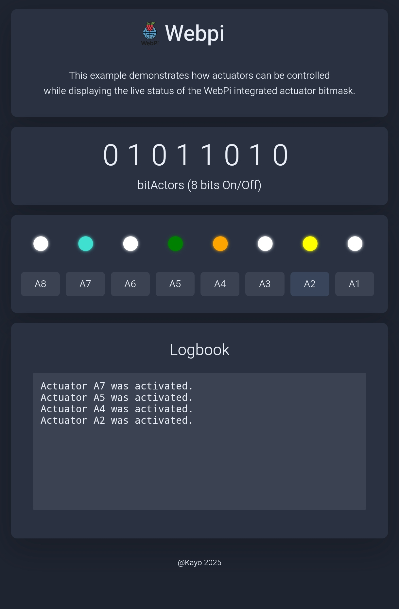
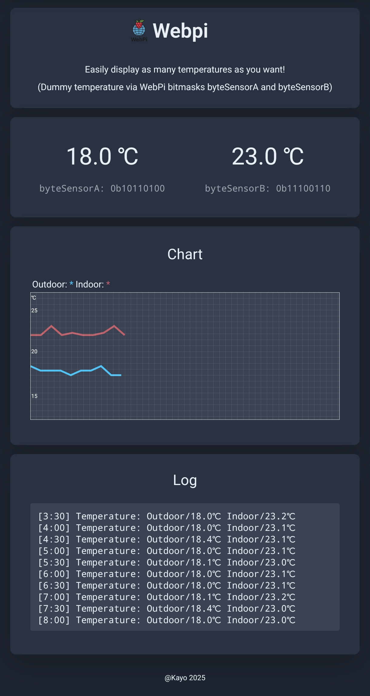

<div align="center">
  
</div>
<h3 align="center">Das Hardware und Software-Logik Framework</h3>
<br>
<br>
<div><h6><a href="NEWS.md">**NEWS**</a><h6><a href="README.md">English version</a> | <a href="STORY.md">Story of WebPi</a></h6></div>


---

**🚀 Die Brücke zwischen modernem Linux und deinen Hardware-Projekten.**

WebPi ist ein schlankes C++-Webinterface-Framework für den Raspberry Pi. Es wurde entwickelt, um Sensoren, Aktoren und Gerätezustände über eine einfache HTTP-API und ein eigenes Webinterface steuerbar zu machen – ganz ohne den Overhead schwerfälliger externer Frameworks.

**„Offen, ehrlich und transparent.“**

WebPi möchte die Welt von C++ und der hardwarenahen Programmierung für jeden zugänglich machen und den Einstieg so einfach wie möglich gestalten.


---

## ⚛️ Die Philosophie
WebPi entstand aus der Erfahrung heraus, dass die Entwicklung auf dem Raspberry Pi immer komplexer wird. Das klassische „GPIO-Gefühl“ – einfach mal schnell eine LED zum Blinken zu bringen – ist ein wenig verloren gegangen.

WebPi bringt dieses Gefühl zurück. Es verpackt komplexe Mechanismen in klare, lesbare und einprägsame Funktionen und macht C++ so für jeden zugänglich.


---

## ✨ Highlights

* **🌐 Eigenständiges Ökosystem:**
     - Integrierter HTTP-Server und modulares Kernsystem. Kein externer Webserver wie Apache oder Nginx erforderlich.

* **💽 WebPiMemory:**
     - Echter RAM? Nein, aber ein perfektes Abbild. Ein Speichermodul für jeden Zweck, kombiniert mit effizienten Funktionen in einem schlanken Design. Mit WebPiEasy wird die Hardware-Steuerung zu reiner High-Level-Programmierung.
     - Integrierte Bitmasken für den sofortigen Start.
     - Bit-Manipulation leicht gemacht: Bits umschalten oder ganze Sensorwerte (8-Bit oder 16-Bit) speichern.
     - WebPiMemory ist in einem einzigen zentralen 64-Bit-Register zusammengefasst. Dieses Hochgeschwindigkeits-Design ist speziell für den ressourceneffizienten Betrieb auf Embedded-Systemen wie dem Raspberry Pi optimiert.

* **🛠 Modulares Design:**
     - Nutze nur das, was du wirklich brauchst.  Header-only-Klassen, bereit für jeden Anwendungsfall – ob innerhalb von WebPi oder für eigenständige Projekte; modular und anpassbar.
     - Das benutzerfreundliche **WebPiEasy** bietet viele vereinfachte Wrapper-Funktionen, ähnlich wie bei einem Arduino-Sketch.
     - Von Hardware-Modulen (Expander, Funkmodule, Distanzsensoren) bis hin zu leicht verständlichen Board-Treibern für SPI, I2C und UART.

* **🔌 GPIO-Steuerung:**
     - Nutze WebPiGPIOV2, den libgpiod WebPiGPIOD-Wrapper oder andere GPIO-Bibliotheken – du entscheidest, was zu deinen Anforderungen passt.
     - Konfiguration über `configPin()`, Lesen/Schreiben über `setPin()` / `getPin()`. Steuer GPIOs mit kurzer, prägnanter Syntax.

* **📖 Ihr Fortschritt:**
     - Viele WebPi-Funktionen bieten Standardparameter, lassen sich aber vollständig mit eigenen Werten anpassen.

* **🛟 WebPi-Start:**
     - Ein menügesteuertes Bash-Tool, das Abhängigkeiten verwaltet und Builds per Knopfdruck erstellt.
     - Erstellt **Projektstrukturen** per Knopfdruck unter Verwendung von Vorlagen für C++, HTML, CSS, JavaScript und CMakeLists.
     - WebPi-Apps und -Beispiele, vergleiche Code über die visuelle Weboberfläche und sehe sofort, was wie und warum funktioniert.
     - **Zentrale Steuerung:** Starten/Stoppen oder lass die Binärdateien im Hintergrund weiterlaufen.
       
* **⚠️ WebPi-Apps:**
     - Sofort einsatzbereite Apps. Pass die Anwendungen an deine Bedürfnisse an und mach daraus dein eigenes Projekt.
     - Alles, was C++, System-Header und WebPi zu bieten haben, findet hier seinen Platz – sei es für den direkten Einsatz oder als Inspiration für deine Visionen.


---

## 🧱 Architektur-Überblick
WebPi ist modular und übersichtlich aufgebaut. Die Erweiterungen sind nicht fest gekoppelt, sodass sie auch für eigene, unabhängige Zwecke genutzt werden können. Binde einfach die gewünschten Bibliotheken in dein Projekt ein und füge sie der CMakeLists hinzu. **Nur die, die du tatsächlich benötigst.**

```

webpi
├── CMakeLists.txt
├── core
│   ├── CMakeLists.txt
│   ├── include
│   │   ├── webpi.hpp
│   │   └── webpi_server.hpp
│   └── src
│       ├── webpi.cpp
│       └── webpi_server.cpp
├── docs
│   └── README.md
├── examples
│   ├── actuators
│   ├── buzzer
│   ├── CMakeLists.txt
│   ├── gethost
│   ├── gpio
│   ├── hellowebpi
│   ├── radioswitch
│   ├── shutter
│   ├── tempsensor
│   └── webpieasy
├── lib
│   ├── CMakeLists.txt
│   ├── extensions
│   │   ├── CMakeLists.txt
│   │   ├── components
│   │   │   ├── CMakeLists.txt
│   │   │   ├── inputs
│   │   │   └── outputs
│   │   ├── devices
│   │   │   ├── CMakeLists.txt
│   │   │   ├── wp_cc1101.hpp
│   │   │   ├── wp_mcp23017_8.hpp
│   │   │   └── wp_vl53l0x.hpp
│   │   ├── driver
│   │   │   ├── CMakeLists.txt
│   │   │   ├── wp_i2c.hpp
│   │   │   ├── wp_spi.hpp
│   │   │   ├── wp_tcp_client.hpp
│   │   │   └── wp_uart.hpp
│   │   ├── gpio
│   │   │   ├── CMakeLists.txt
│   │   │   ├── wp_gpiod_wrap.hpp
│   │   │   └── wp_gpio_v2.hpp
│   │   ├── module
│   │   │   ├── CMakeLists.txt
│   │   │   ├── wp_counter.hpp
│   │   │   ├── wp_filetools.hpp
│   │   │   ├── wp_logbook.hpp
│   │   │   ├── wp_minimodbus.hpp
│   │   │   └── wp_mqtt.hpp
│   │   └── README.md
│   └── wpeasy
│       ├── CMakeLists.txt
│       ├── README_DE.md
│       ├── README.md
│       ├── wp_easy.hpp
│       ├── wp_json.hpp
│       ├── wp_math.hpp
│       ├── wp_out.hpp
│       ├── wp_parse.hpp
│       ├── wp_string.hpp
│       ├── wp_system.hpp
│       └── wp_time.hpp
├── projects
│   └── README.md
├── resources
│   ├── benchmark
│   ├── images
│   ├── tools
│   ├── webpistart
│   ├── webpicode
│   └── README
├── source.list
├── templates
│   ├── cmake
│   ├── libs
│   ├── README.md
│   ├── web
│   └── webpi
└── webpistart
     ├── bash
     │   ├── apps.bash
     │   ├── build.bash
     │   ├── conf.bash
     │   ├── dependencies.bash
     │   ├── examples.bash
     │   ├── main.bash
     │   ├── msg.bash
     │   ├── projects.bash
     │   ├── sources.bash
     │   └── status.bash
     ├── CHANGELOG.md
     ├── data
     │   └── remote_source.list
     ├── README.md
     ├── templates
     │   ├── base.cpp
     │   ├── cmakelists.txt
     │   └── web
     │       ├── app.js
     │       ├── images
     │       ├── index.html
     │       └── style.css
     └── webpistart.sh


```

---

🔢 Das Bitmasken-Konzept
WebPi macht Binärlogik sichtbar. Beispiele wie `actuators` oder `shutter` demonstrieren direkt, wie die interne 8-Bit-Maske mit der Weboberfläche interagiert.


<div align="center">



Klarheit durch Visualisierung: Bitmasken-Zustände in Echtzeit.
</div>


---

📈 Bereit für Daten
Ob Temperaturprotokolle oder Systemüberwachung – WebPi hilft Ihnen bei der Umsetzung Ihrer Ideen.  <div align="center">

  
Beispiel für die Sensorintegration mit SVG-Diagrammen und Protokollierungsfunktion.
</div>


---

🛠️ WebPi-Status
WebPi befindet sich in einem fortgeschrittenen Stadium und steht kurz vor der Veröffentlichung.
Du kannst die Entwicklung über die SourceList und die regelmäßigen News verfolgen.

Bleib dran!


---

📖 Rechtliche Hinweise und Lizenzen

Logo & Branding:

Das WebPi-Logo ist ein eigenständiges Design und keine offizielle Grafik der Raspberry Pi Foundation.


Rechtlicher Hinweis:

Raspberry Pi ist eine Marke der Raspberry Pi Foundation. Dieses Projekt steht in keiner Verbindung zur Raspberry Pi Foundation und wird von dieser weder unterstützt noch in anderer Weise assoziiert.


Lizenz:

Dieses Projekt steht unter der [MIT-Lizenz](LICENSE).
