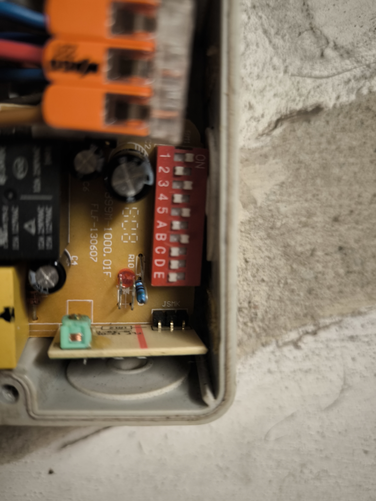

## 📖 The Story of WebPi

**From a Locked Garage to a Framework**

🖥️ The Beginning: The Reliable "Stone Age"
Years ago, I built a rock-solid access control system for my garage and side door. It was powered by an ATtiny84 for the keypad and an ATtiny2313 as the master. No internet, no updates, no drama. It worked for years without a single reboot. It was simple, but it was "dumb."

🏚️ The Hype: Enter Smart Home & The ESP32
When Smart Home became the "next big thing," I decided my garage needed an upgrade. I wanted to see everything in Home Assistant: Is the door open? Is the car inside? Who entered which code?

I swapped the old hardware for an ESP32, added an MCP23017 for more I/O, and put everything into a nice new housing.

☠️ The Disaster: Reality Strikes
Then the problems started.

🧱 The WiFi Wall: Garage walls are thick. My signal fluctuated between -70 dBm and -90 dBm. Constant drops.

👿 The Library Hell: To get stable Ethernet (W5500), I had to use outdated, unmaintained libraries. I was stuck in an old IDE version, afraid to update anything because the whole stack might collapse.

⛔ The Lock-Out: The system would hang at the worst possible moments. I spent two hours waiting in front of my own house because the "Smart" system refused to open the door and I didn't have a physical key on me.

🚧 That was the breaking point. I was done with fragile setups.

## That was the breaking point. I was done with fragile setups.

💡 The Revelation: Why not use a Raspberry Pi?
I had a few Raspberry Pis lying around. They have native Ethernet, massive processing power, and a real file system. But when I looked for a "simple" way to control GPIOs like I did in the Arduino world.

❔I found:

Dead libraries (WiringPi).

Overly complex industrial drivers (libgpiod).

Huge web frameworks that felt like trying to kill a fly with a bazooka.

🎉 The Birth of WebPi
I wanted a framework that feels like Arduino but has the power of Linux.

💥 Simple: wp.server(), gpio.configPin(), gpio.setPin(), wp.on("/route").

🌟 Stable: Multi-threaded, separate logic from network.

🔒 Safe: Runs as a standard user, not root.

🧩 Modular: Drivers for MCP expanders and VL53L0X lasers included.

Today, WebPi controls my garage. It’s fast, it’s reliable, and it was born from the frustration of being locked out of my own home.

🏁 The Result: GaragePi is alive!
This isn't just a prototype on a desk. This is the actual unit mounted in my garage. I call it GaragePi.

No more lock-outs: Thanks to the stable C++ core and wired Ethernet.

Easy Maintenance: If I want to change a code or a timing, I do it via the WebPi API.

Full Control: From the Schurter Keypad to the VL53L0X laser checking if the car is inside.

  

