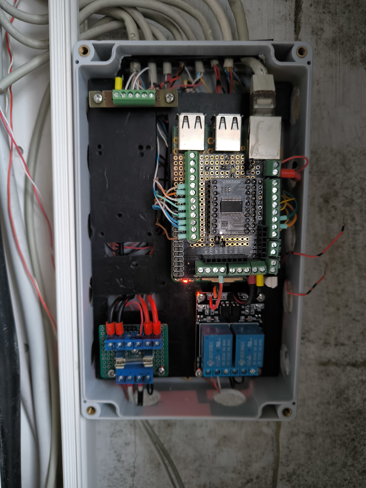
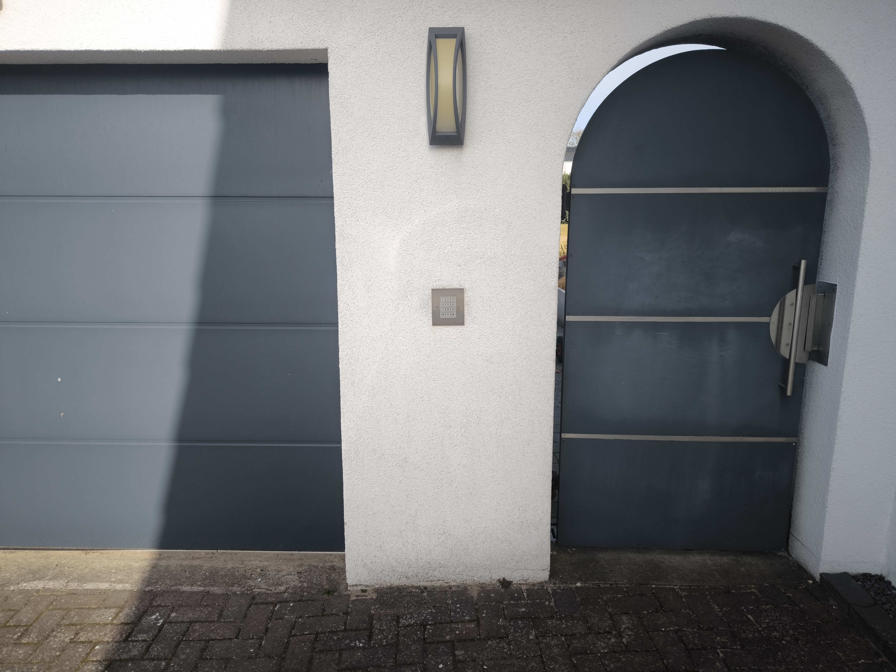
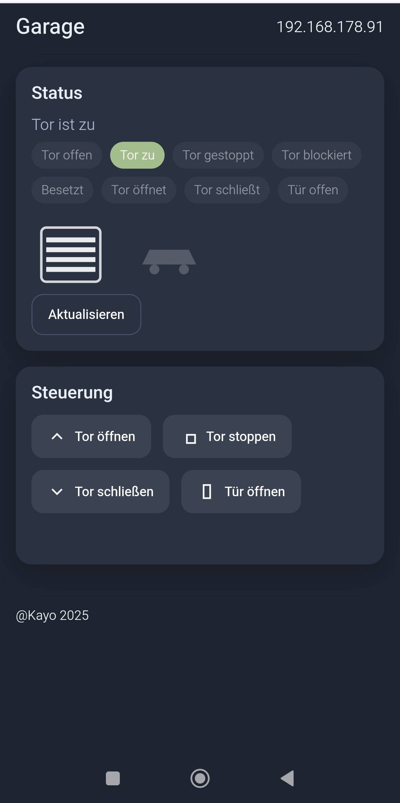
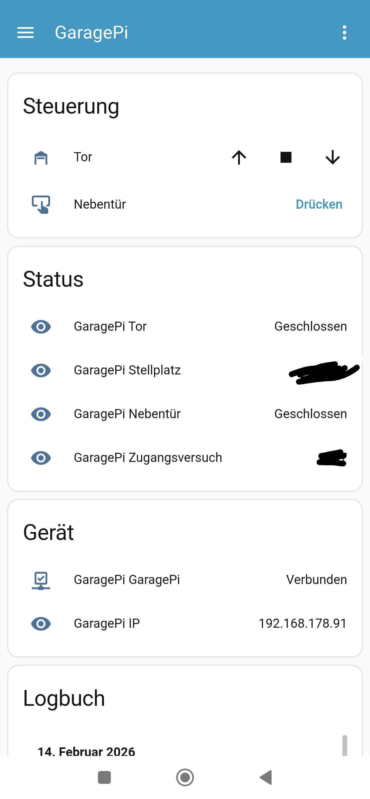
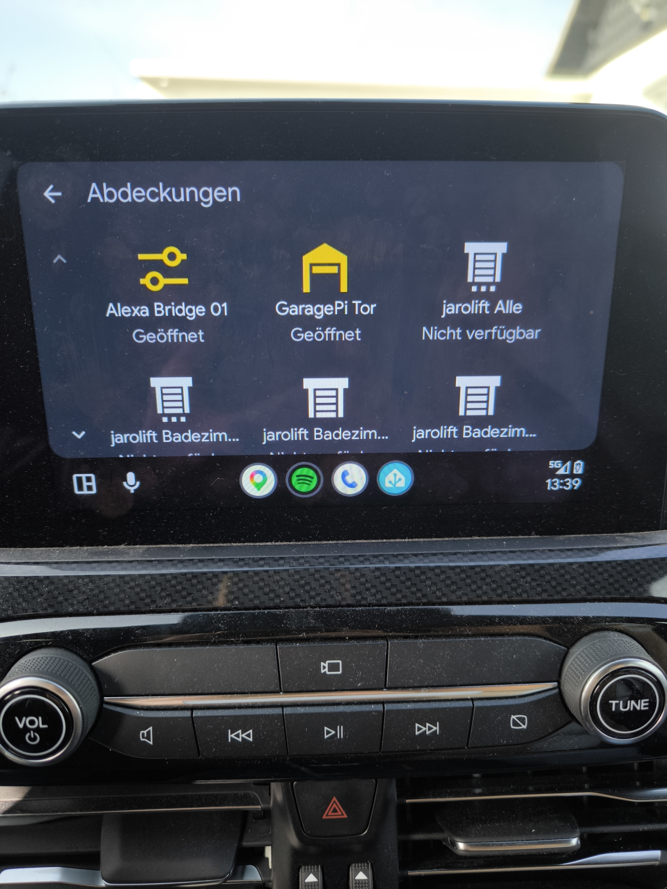

## 📖 The Story of WebPi

**From a Locked Garage to a Framework**
  

🖥️ The Beginning:

The Reliable "Stone Age"

Years ago, I built a rock-solid access control system for my garage and side door.
It was powered by an ATtiny84 for the keypad and an ATtiny2313 as the master.
No internet, no updates, no drama. It worked for years without a single reboot. It was simple, but it was "dumb."
  

🏚️ The Hype:

Enter Smart Home & The ESP32

When Smart Home became the "next big thing," I decided my garage needed an upgrade.
I wanted to see everything in Home Assistant "Is the door open?" "Is the car inside?" "Who entered which code?"
I swapped the old hardware for an ESP32 and put everything into a nice new housing.
But the project got off to a bad start from the beginning: non-functional sun-sensitive light barriers, cheap ultrasonic sensors, and far too few GPIOs.

  

☠️ The Disaster:

Reality Strikes
Then the problems started.
  

🧱 The WiFi Wall:

Garage walls are thick. My signal fluctuated between -70 dBm and -90 dBm. Constant drops.
  

👿 The Library Hell:

To establish a stable Ethernet connection (W5500) in conjunction with littleFS and LwIP Ethernet, I had to use outdated, unmaintained libraries. I was reliant on an old IDE version and was afraid to update anything, as this could cause the entire stack to crash.

  

⛔ The Lock-Out:

After numerous failures, I couldn't guarantee reliable operation. I tried stabilizing the power supply: new power supply, filters and smoothers, better cables, and a hard reset of the  W5500 with a software watchdog. Nothing could keep the hardware combination running for more than a few days. I was never able to pinpoint the exact problem; perhaps it was the SPI interface.

The system always crashed at the worst possible moment.
My daughter, who had forgotten her house key, spent two hours outside in the rain and couldn't even get into the garage or onto the patio because the "smart" system refused to open the door.
Of course, it was my fault, she said!
  

🚧 That was the breaking point. I was done with fragile setups.
  
  

💡 The Revelation:

Why not use a Raspberry Pi?
I had a few first-generation Raspberry Pis lying around. They have native Ethernet, enormous processing power, and a proper file system. But when I was looking for a simple way to control GPIOs like with WiringPi or the Arduino world....
  

❔I found:

Dead libraries (WiringPi).

Overly complex industrial drivers (libgpiod).

Huge web frameworks that felt like trying to kill a fly with a bazooka.
  
  

🎉 The Birth of WebPi:
I wanted a framework that feels like Arduino but has the power of Linux.

💥 Simple: wp.server(), gpio.configPin(), gpio.setPin(), wp.on("/route").

🌟 Stable: Multi-threaded, separate logic from network.

🔒 Safe: Runs as a standard user, not root.

🧩 Modular: Drivers for MCP expanders and VL53L0X lasers included.

🛠️ The work began

---

  
Today, WebPi controls my garage.
It’s fast, it’s reliable, and it was born from the frustration of being locked out of my own home.
  

## 🏁 The Result:

GaragePi is here!

This isn't just a prototype on my desk. This is the finished device, sitting in my garage. I call it GaragePi.
No more lockouts, thanks to the stable C++ kernel and wired Ethernet.
If I want to change a code or timing, I can do it conveniently from my office.

Full control: 
From the Schurter keypad to the VL53L0X that checks if the car is in the garage, via reed switches (open/closed/blocked), opening/closing, opening the side door, and control from all sorts of devices.
Status values, control and access logging overview in Home Assistant.

That's how I wanted it!

  

  

  

  

  

